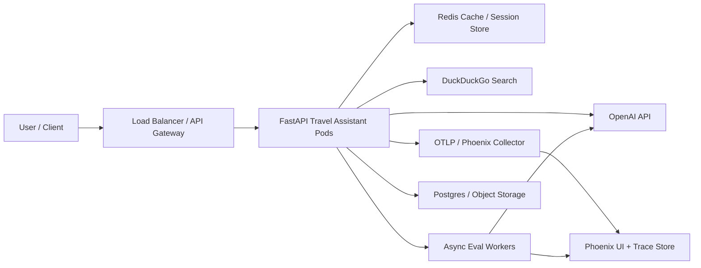

# Production Architecture

## Deployment Notes

- Keep the FastAPI service stateless so it can scale horizontally behind a load balancer.
- Cache repeated destination lookups and time-sensitive search results in Redis to reduce latency and cost.
- Send all agent traces to Phoenix through OTLP and keep async evaluation workers separate from user-serving traffic.
- Persist query artifacts, exports, and presentation-ready evidence in object storage or Postgres-backed metadata tables.
- In production, sample traces selectively for cost control while keeping full tracing in local and staging environments.
